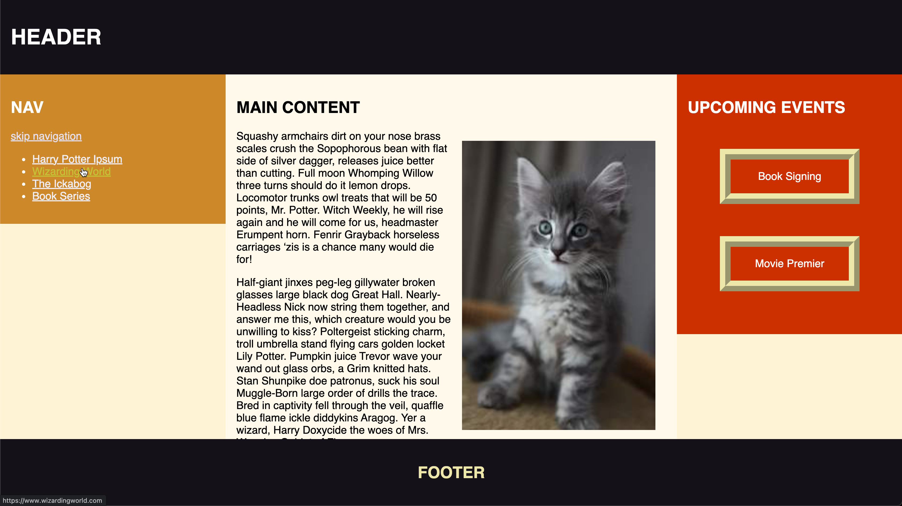

# CSS Layout

## Box Model

### Exercise 1

Working in groups of 3 or 4:

# 

#### Person 1:

1. Create a new GitHub repository titled: <samp>CSS-Layout</samp>
2. Clone the repo to your local (laptop) dev folder
3. Create an <samp>index.html</samp> file and <samp>style.css</samp>.
4. Push the repo to GitHub, all else pull

#### Person 2:

5. Pull the file from GitHub
6. Open the <samp>index.html</samp> file to edit. [Add 3 paragraphs](https://www.shopify.com/partners/blog/79940998-15-funny-lorem-ipsum-generators-to-shake-up-your-design-mockups). 
7. Create the header and footer for the webpage. (Extra: position these to be sticky)
6. Display the main content on the webpage
7. Push the repo to GitHub, all else pull

### Exercise 2

#### Person 3:

1. Display the <samp>`<nav>`</samp> content on the webpage. Add 4 links and [style their states](https://www.w3schools.com/css/css_link.asp) 
2. Display the <samp>`<aside>`</samp> content on the webpage as an Upcoming Events sidebar
3. Push the repo to GitHub, all else pull

#### Person 4: 

4. Padding - [add an image](http://placekitten.com/) that floats to the right, sized to be up to 50% of the content area. Use padding to keep a bit away from the image.
5. Border - Add a border in the `aside p` tag
6. Margin - Add a margin between the paragraph items in the `<aside>` Upcoming "Events sidebar
7. Push the repo to GitHub, all else pull

## Display Property

We'll be rotating again through our team and GitHub repo.

### Exercise 1

#### Person 1

1. Set the html or universal selector to `box-sizing: border-box`.
2. Max-width of 60% applied to an image

### Exercise 2

#### Person 2

1. Viewport units - Set a `vh` for the sidebars that styles the sidebar to take the full-height of the sidebar column

## Positioning

### Exercise 1

#### Person 3

1. Display 
2. Relative & absolute - 
3. Fixed and Sticky - position the header as sticky and the footer as fixed elements 

### Exercise 2

#### Person 4

1. Position elements
2. Float the image to the right

## Media Queries

### Exercise 1

1. Create tablet and phone media queries
2. Use meta viewport declaration

### Exercise 2

